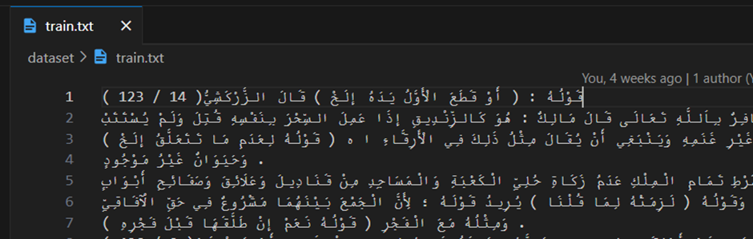

# Tashkila

## Project Pipeline:

### Data Pre-Processing:
- Cleaning and processing input dataset.
- Tokenization using byte pair encoding.
- Feature extraction.
- Continuous bag of words (CBOW).
- Embedding layer.
- One hot encoding.

### Training our Model:
- Manipulating all parameters like number of layers, embedding size, learning rate, number of epochs, batch size, etc.
- Saving and loading the model with checkpoints and evaluating them to know how DER is affected.
- Calculating loss:
  - The loss is calculated after each batch.
  - Total cross-entropy is calculated after each epoch.
  - Updating weights and repeating.

### Evaluation:
- Generating the files as stated in the instructions.
- Calculating the DER.

### Data Pre-Processing:
- Deleting Arabic and English numbers.
- Deleting and reducing spaces.
- Splitting on punctuation marks that clearly split sentences.
- Splitting the data into X, X_words, and Y if the data is labeled and saving them as letters and words.
- Merging all the text found in the training and validation dataset into one text file for tokenization purposes.

#### Samples:

### Models:

1. **Sequence to Sequence (Word-Letter):**

   - Description: Encoder and decoder built using LSTM. Encoder input is the sequence of words of the sentence, and the decoder input is the characters of the sentence.
   - Best Accuracy: 76%

2. **Sequence to Sequence (Letter-Letter):**

   - Description: Similar to the previous model but with encoder input as the sequence of letters and decoder input as a sequence of labels.
   - Best Accuracy: 75%

3. **Sequence to Sequence with Attention (Word-Letter):**

   - Description: Used attention mechanism to focus on specific parts of the sentence.
   - Not trained due to high computational cost.

4. **Decoder (LSTM):**

   - Description: Consists of only the decoder. Input is the character to be diacritized, output is the diacritics.
   - Best Accuracy: 92%

5. **(ACCIO) Multi-Layer Bidirectional LSTM:**

   - Description: Consists of 3 bidirectional LSTM layers. Takes CBOW-generated embeddings as initialization.
   - Best Accuracy: 98.6%

6. **(ACCIO) Multi-Layer Bidirectional LSTM with Word2Vec:**
   - Description: Similar to the previous model but with Word2Vec embeddings.
   - Accuracy: Comparable to the previous model.

7. **(ACCIO) Multi-Layer with Deeper Layers:**
   - Description: Similar to the normal ACCIO model but with more and deeper fully connected layers at the end.
   - Accuracy: Comparable to the previous model but weaker during training.

### Feature Extraction:

1. **CBOW Word2Vec:**
   - Implementation of CBOW from lectures.
   - Used different window sizes to capture longer contexts.
   - Generated sentence embedding by averaging word embeddings.

2. **One Hot Encoding**

3. **Trainable Embedding Layer:**
   - Embedding layer used for word representations.

## DER for all Trials:

- Sequence to Sequence (Word-Letter): 24%
- Sequence to Sequence (Letter-Letter): 25%
- Decoder: 8%
- ACCIO: 1.4%

The model used in the submission is ACCIO due to its lowest DER.

## Demos:

### Input:
ذهب محمد وفادي إلى المدرسة وهناك يلتقيان بأصدقائهما ، ويتعلمان الكثير من الأشياء الجديدة والمفيدة.

### Output:
ذَهَبَ مُحَمَّدٌ وَفَادِي إلَى الْمَدْرَسَةِ وَهُنَاكَ يَلْتَقِيَانِ بِأَصْدِقَائِهِمَا ، وَيَتَعَلَّمَانِ الْكَثِيرَ مِنْ الْأَشْيَاءِ الْجَدِيدَةِ وَالْمُفِيدَةِ

### Input:
صعد أدهم وحمزة الشجرة حتى يقطعا الطريق على الأشرار وينقذا الأميرة ولكن لم ينجحا في ذلك ولكنهما تمكنا من الهرب والعودة إلى القرية وتقرر الأميرة الزواج من أدهم وتعيشا سعيدين معا، ولكن قال حمزة: لا يوجد أشرار على الشجرة

### Output:
صُعِدْ أَدْهَمَ وَحَمْزَةَ الشَّجَرَةِ حَتَّى يَقْطَعَا الطَّرِيقَ عَلَى الْأَشْرَارِ وَيُنْقِّذَا الْأَمِيرَةَ وَلَكِنْ لَمْ يُنَجِّحَا فِي ذَلِكَ وَلَكِنَّهُمَا تَمَكَّنَا مِنْ الْهَرَبِ وَالْعَوْدَةِ إِلَى الْقَرْيَةِ وَتَقَرَّرُ الْأَمِيرَةُ الزَّوَاجُ مِنْ أَدْهِمَ وَتَعَيُّشًا سَعِيدَيْنِ مَعًا، وَلَكِنْ قَالَ حَمْزَةُ لَا يُوجَدُ أَشْرَارٌ عَلَى الشَّجَرَةِ
